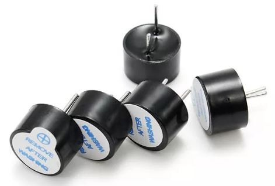
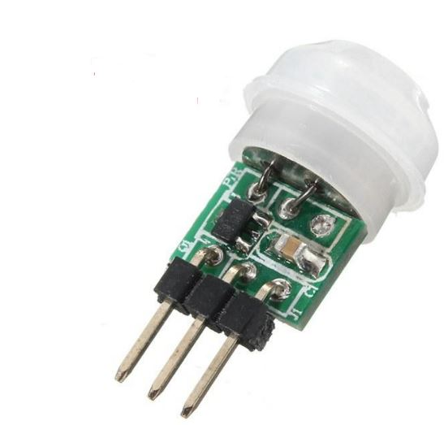
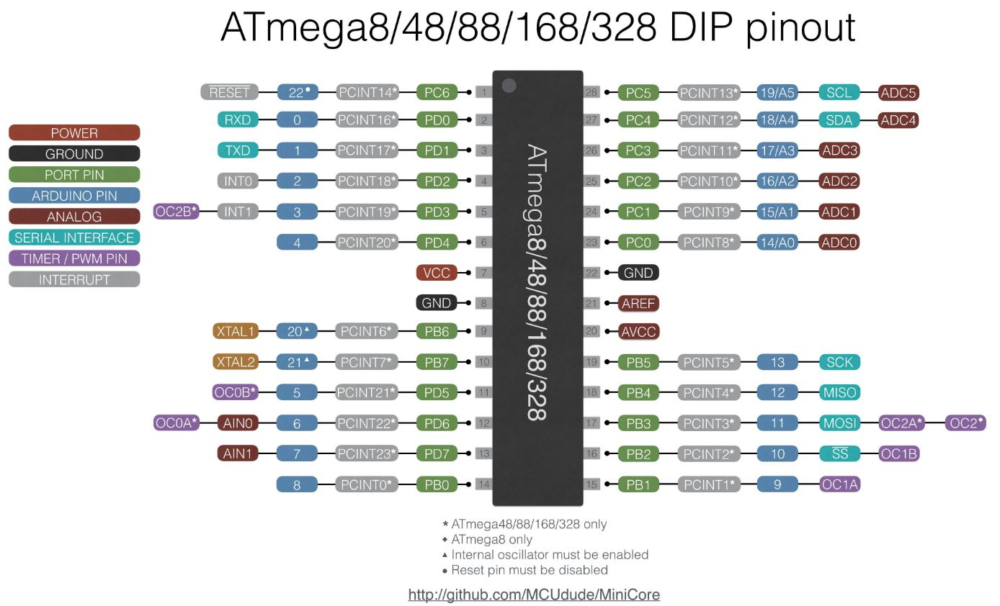

# PIR ATMega328P Deep-Sleep project
## See https://www.youtube.com/ralphbacon
### (Direct link to video: https://youtu.be/7ChTq7ZHVTI)

### 2-sided PCB just $5 for 10 pieces https://www.pcbway.com
**PCB Prototyping the easy way - see my video #129 for Hands-On details**

This relatively simple project, ideal for a beginner, is a movement triggered alarm, as long as it is dark. 

    
It runs on 3 x AA batteries so the ATMega328P I'm using is put into Deep Sleep and consumes just 0.3µA, whereas the PIR consumes 16µA - quite a difference!

It's a easy project and I'll design a PCB for it using through-hole technology making it even easier for beginners to assemble without worrying about SMD components!

One of the benefits of a simple project like this is that it can be configured in a number of ways: instead of it having to be **dark** to trigger the alarm it can be made to be **light** instead. And the sensitivity is adjustable, anyway.

Don't want the beeper? Just use the LED and singel resistor then. You want the alarm to sound for more than 5 seconds? That's a simple one-line code change! And more changes are just as easy to implement, either in code or in hardware.

You want to a different module to trigger the ATMega328P? Easily done.

The video contains a structured walkthrough, circuit diagram and various verbal meanderings from me including showing you the current consumption both with and without the PIR unit.

### MiniCore

There wasn't enough time to talk about the **MiniCore** this week, but I'll include that the next time we look at this project's progress. It's very useful if you want to change the bare ATMega's clock speed, BOD, LTO and so on. We'll go through it next time.  

## LINKS

Small **beeper**: 5 PCS Super Loud 5V Active Alarm Buzzer Beeper Tracker 9\*5.5mm
https://www.banggood.com/5-PCS-Super-Loud-5V-Active-Alarm-Buzzer-Beeper-Tracker-95_5mm-for-Racing-Drone-p-1117207.html?p=FQ040729393382015118&utm_campaign=25129675&utm_content=3897  

Small **PIR module** (5 pieces you can buy singly or in threes too)  
https://www.banggood.com/5Pcs-Mini-IR-Infrared-Pyroelectric-PIR-Body-Motion-Human-Sensor-Detector-Module-p-1020426.html?p=FQ040729393382015118&utm_campaign=25129675&utm_content=3897

ATMega328P pin out (Arduino vs Physical Pins etc)  
https://camo.githubusercontent.com/c55beef2f138da61fe671a1e4a307ff4ffbc318d/68747470733a2f2f692e696d6775722e636f6d2f715849456368542e6a7067

If you like this video please give it a thumbs up, share it and if you're not already subscribed please consider doing so and joining me on my Arduinite journey

My channel and blog are here:  
\------------------------------------------------------------------  
https://www.youtube.com/RalphBacon  
https://ralphbacon.blog  
\------------------------------------------------------------------
